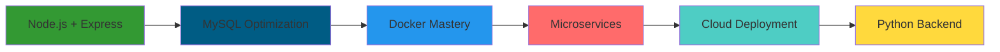

# 🌟 JsEndiFray | Full Stack Developer

<div align="center">

  <!-- Animated Banner -->
  

  <!-- Typing Animation -->
  

<br><br>

  <!-- Status Badges with better spacing -->
  <p align="center">
    
    <br><br>
    
    <br><br>
    
  </p>

</div>

---

## 🎯 Sobre mí

```javascript
const endiFray = {
    role: "Full Stack Developer Junior",
    focus: "Backend Specialist",
    level: "Junior - En constante aprendizaje 📚",
    formation: "Atrium Bootcamp (2023-2024)",
    currentProject: "Sistema de Facturación Empresarial",
    architecture: ["MEAN Stack", "Learning Docker", "API Development"],
    mindset: "Aprendiendo cada día, construyendo el futuro 🚀"
};

console.log("Siempre aprendiendo, siempre mejorando! 💪");
```

---

## 🛠️ Tech Stack & Tools

<div align="center">

### 🎨 Frontend
<br>


### ⚡ Backend & APIs
<br>


### 🗄️ Databases
<br>


### 🔧 DevOps & Tools
<br>


</div>

---

## 🚧 Proyectos Actuales

<table>
<tr>
<td width="50%">

### 🧾 BackFacturas - Sistema de Facturación
**Stack:** Node.js + Express + MySQL + Angular + Docker

**Características:**
- 🏗️ Arquitectura por capas (MVC)
- 🔐 Autenticación JWT + Roles
- 🐳 Contenerización completa
- 📝 Documentación con Swagger
- 🛡️ Rate Limiting & Validaciones
- 🎨 Frontend Angular responsive

</td>
<td width="50%">

### 🔧 Otros Proyectos en Desarrollo
- **API RESTful con Node.js & MySQL**
- **Gestor de Roles y Permisos**
- **Microservicios con Docker Compose**
- **Sistema de Autenticación JWT**

**Próximamente:**
- Portfolio Personal
- Blog Técnico
- Sistema de E-commerce

</td>
</tr>
</table>

---

## 📈 Roadmap de Aprendizaje 2024-2025



**🎯 Objetivos actuales:**
- ✅ Consolidar Node.js + Express + MySQL
- 🔄 Aprendiendo Docker & Contenarización
- 📋 Implementar mejores prácticas
- 🚀 Primer deploy profesional
- 📚 Expandir conocimientos hacia Python

---

## 📊 Estadísticas & Actividad

<div align="center">

  <!-- GitHub Stats Cards -->
  
  

  <!-- Streak Stats -->
  <br>
  

  <!-- Activity Graph -->
<br><br>


  <!-- GitHub Profile Summary Cards -->
<br><br>


</div>

---

## 🏆 Achievements & Skills

<div align="center">

<!-- Achievements -->


</div>

### 💪 Core Competencies

<table>
<tr>
<td valign="top" width="33%">

**🔥 Technical Skills**
- Node.js & Express.js (Aprendiendo)
- MySQL Database Design
- RESTful API Development
- Docker (En proceso)
- Angular Frontend
- Git Version Control

</td>
<td valign="top" width="33%">

**🧠 Soft Skills**
- Problem Solving
- Continuous Learning
- Team Collaboration
- Attention to Detail
- Project Management
- Technical Documentation

</td>
<td valign="top" width="33%">

**🎯 Currently Learning**
- Docker & Containerization
- Microservices Architecture
- Advanced Node.js patterns
- Testing & Best Practices
- Cloud Deployment basics
- Python (Futuro objetivo)

</td>
</tr>
</table>

---

## 🌐 Conecta Conmigo

<div align="center">

[](https://www.linkedin.com/in/endifray/)
[](mailto:endifmv@gmail.com)
[](#)
[](https://github.com/JsEndiFray)

### 💬 ¡Hablemos de código!

> *"Soy junior, pero mi pasión por aprender y crear soluciones backend crece cada día. Siempre abierto a consejos, colaboraciones y nuevos desafíos."*

**📍 Madrid, España** | **🌱 Junior en crecimiento** | **🚀 Aprendiendo continuamente**

</div>

---

<div align="center">

  <!-- Views Counter -->
  

  <!-- Footer Wave -->
  

</div>

<!-- Hidden ASCII Art -->
<!--
     ██╗███████╗███████╗███╗   ██╗██████╗ ██╗███████╗██████╗  █████╗ ██╗   ██╗
     ██║██╔════╝██╔════╝████╗  ██║██╔══██╗██║██╔════╝██╔══██╗██╔══██╗╚██╗ ██╔╝
     ██║███████╗█████╗  ██╔██╗ ██║██║  ██║██║█████╗  ██████╔╝███████║ ╚████╔╝ 
██   ██║╚════██║██╔══╝  ██║╚██╗██║██║  ██║██║██╔══╝  ██╔══██╗██╔══██║  ╚██╔╝  
╚█████╔╝███████║███████╗██║ ╚████║██████╔╝██║██║     ██║  ██║██║  ██║   ██║   
 ╚════╝ ╚══════╝╚══════╝╚═╝  ╚═══╝╚═════╝ ╚═╝╚═╝     ╚═╝  ╚═╝╚═╝  ╚═╝   ╚═╝   
-->

**⭐ Si te gusta mi trabajo, no olvides darle una estrella a mis repositorios ⭐**